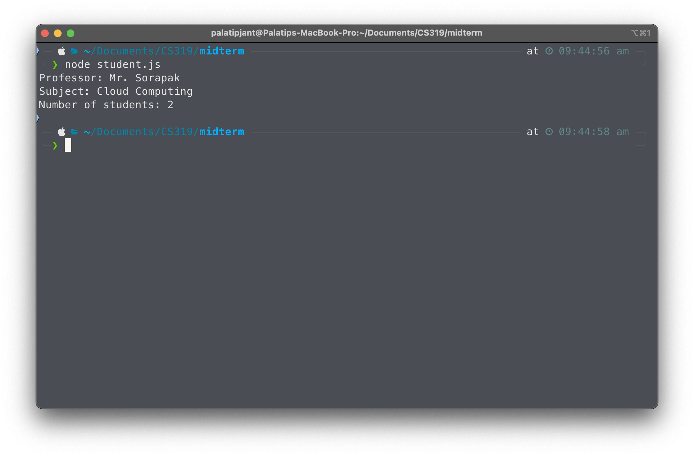
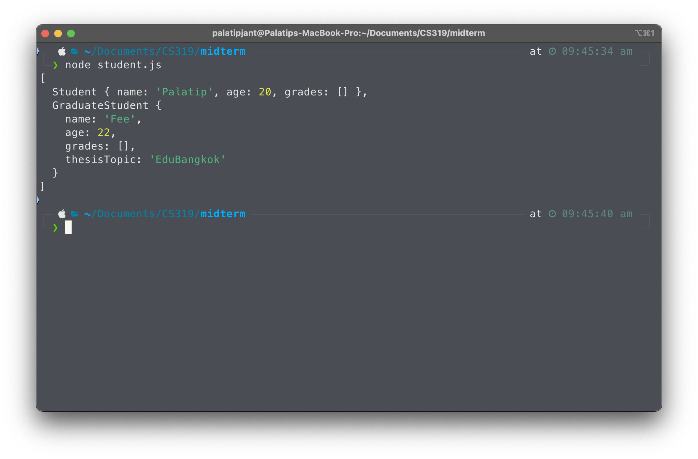
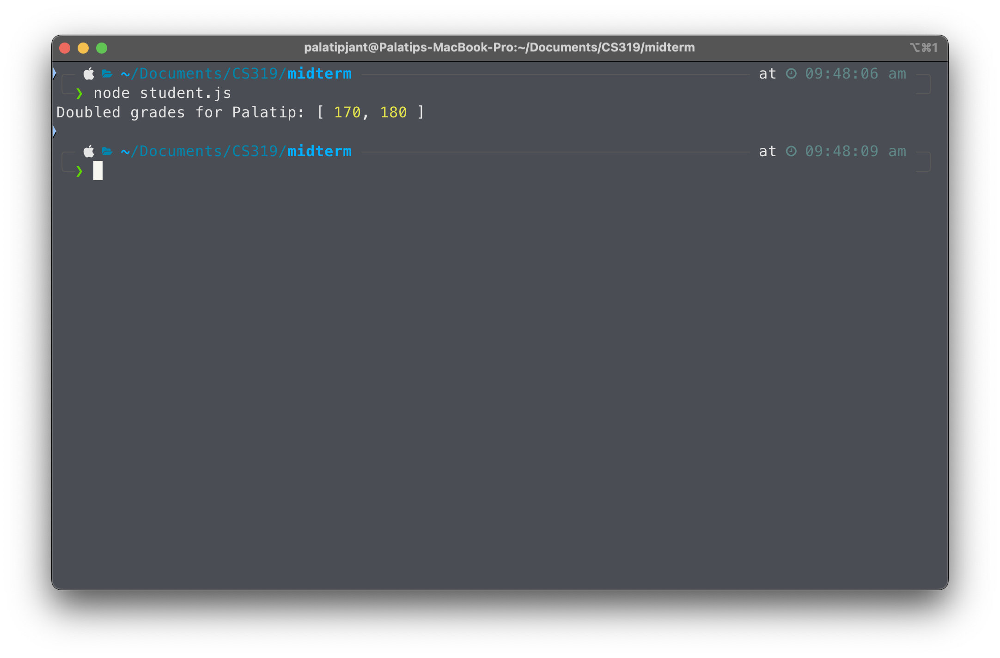
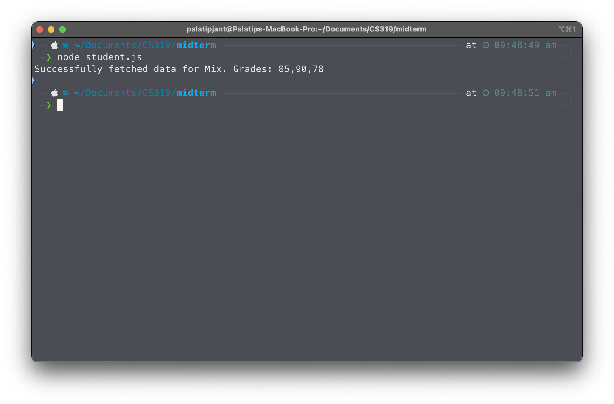
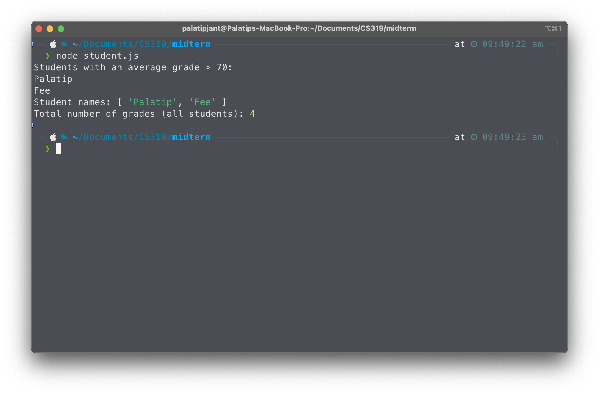
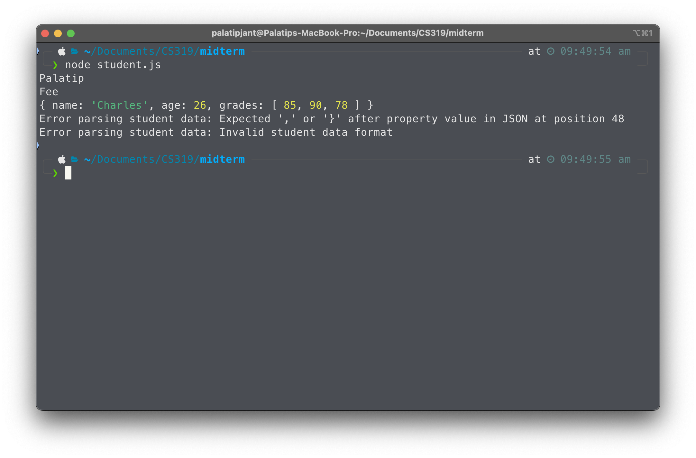
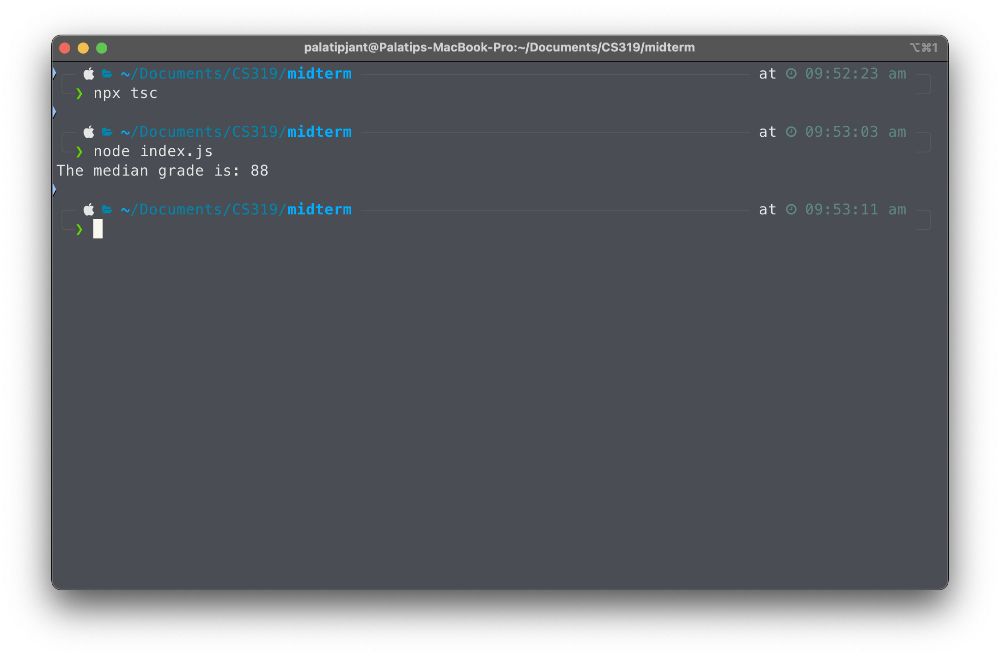

# Student Management System

## เรื่องที่ได้ใช้งาน

- TypeScript
- Object-Oriented Programming (OOP)
- Asynchronous Programming with Promises
- Interfaces and Generics
- Array Methods
- Error Handling
- Modules and Imports/Exports

## Part ต่าง ๆ

1. **Part 1: Class and Object-Oriented Programming**
   - สร้างคลาส `Student` พร้อมกับ properties `name`, `age`, และ `grades`
   - สร้างเมธอดสำหรับการเพิ่มเกรดและคำนวณเกรดเฉลี่ย
   - สร้าง static method เพื่อนับจำนวนของนักเรียน
   - 

2. **Part 2: Inheritance and Polymorphism**
   - สร้างคลาส `GraduateStudent` โดยใช้ extend จากคลาส `Student` และเพิ่ม property `thesisTopic`
   - override method `getAverageGrade()` เพื่อให้โบนัสสำหรับนักเรียนที่หัวข้อวิทยานิพนธ์เกี่ยวกับ AI
   - 

3. **Part 3: Type Annotations and Interfaces**
   - ประกาศ Interface `Teacher` ที่มี properties สำหรับ `name`, `subject`, และ `students`
   - สร้างฟังก์ชันเพื่อเพิ่มข้อมูลของครู
   - 

4. **Part 4: Generics**
   - สร้าง Generic คลาสชื่อว่า `Database<T>` ที่สามารถจัดเก็บข้อมูลประเภทใดก็ได้ เช่น `Student` หรือ `Teacher`
   - สร้าง method `addEntry` และ `getEntries` เพื่อเพิ่มและเรียกคืนรายการจากฐานข้อมูล
   - 

5. **Part 5: Functions and Higher-Order Functions**
   - สร้าง higher-order ฟังก์ชัน `createGradeMultiplier(multiplier: number)` ที่ return ฟังก์ชันเพื่อคูณเกรด
   - แสดงการใช้งานโดยการสร้างฟังก์ชัน `doubleGrade` เพื่อเพิ่มเกรดนักเรียนเป็นสองเท่า
   - 

6. **Part 6: Asynchronous Programming**
   - สร้างฟังก์ชันแบบ async `fetchStudentData()` เพื่อจำลองการดึงข้อมูลนักเรียนจาก API
   - ใช้ `async/await` เพื่อจัดการการเรียก และการทำ error handling
   - 

7. **Part 7: Array Methods**
   - ใช้ method `filter()`, `map()`, และ `reduce()` ของ array ในการประมวลผลข้อมูลนักเรียน
   - เรียกนักเรียนตามเกรดเฉลี่ย แสดงชื่อของนักเรียน และคำนวณจำนวนเกรดทั้งหมด
   - 

8. **Part 8: Error Handling**
   - สร้างฟังก์ชัน `parseStudentData(jsonData: string)` ที่จะตรวจดู JSON ของข้อมูลนักเรียน
   - ใช้ `try/catch` เพื่อ error handling
   - 

9. **Part 9: Modules and Imports/Exports**
   - สร้างฟังก์ชัน `calculateMedianGrade(grades: number[])` ในไฟล์แยก (`studentUtils.ts`) เพื่อคำนวณค่ากลาง
   - import ฟังก์ชันใน `index.ts` และแสดงการใช้งานเพื่อตรวจสอบค่ากลางเกรดของนักเรียน
   - 